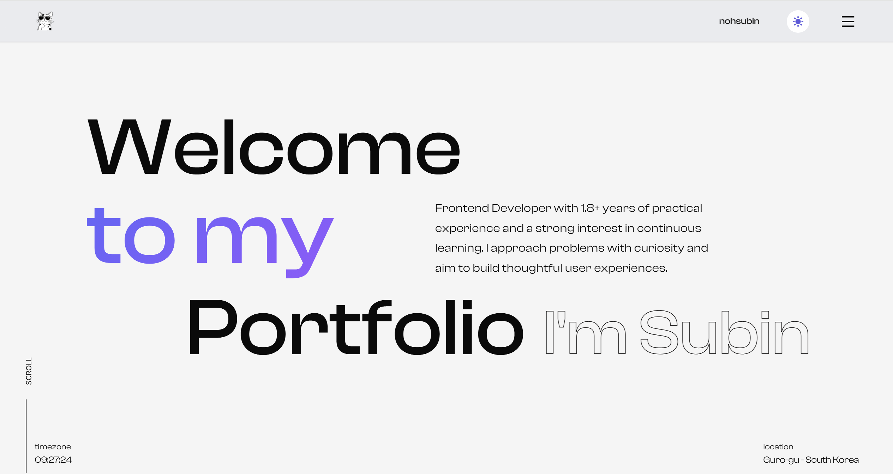
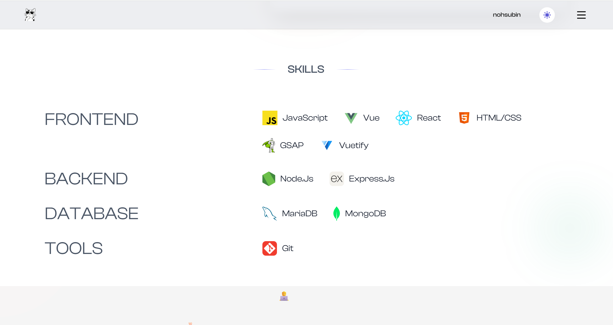
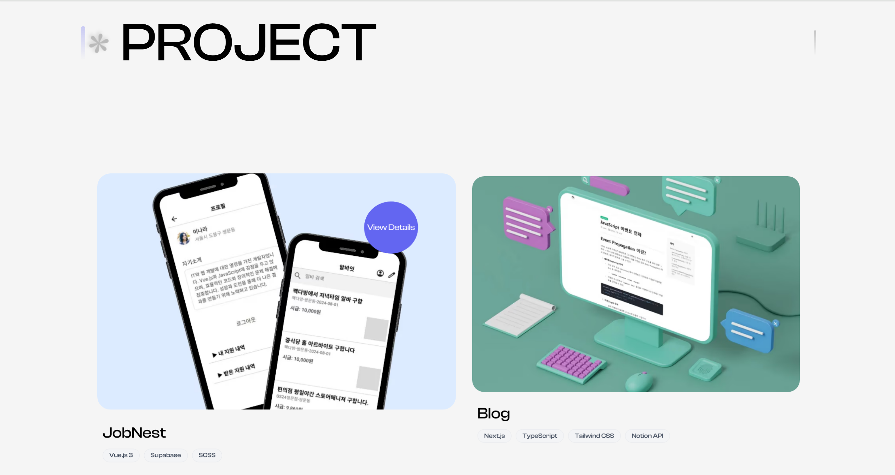
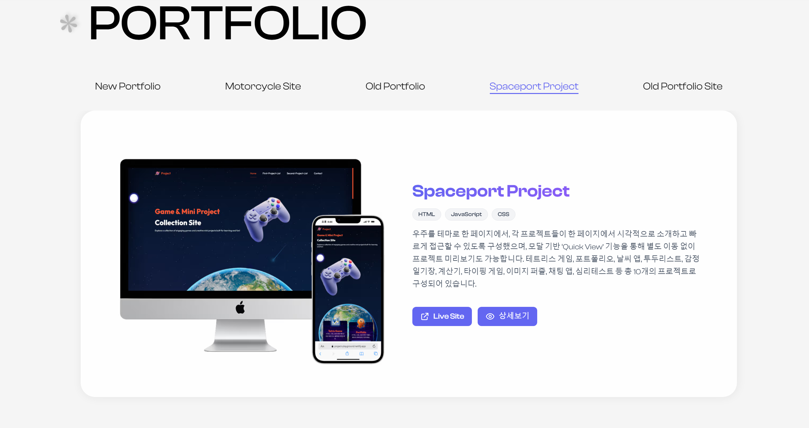
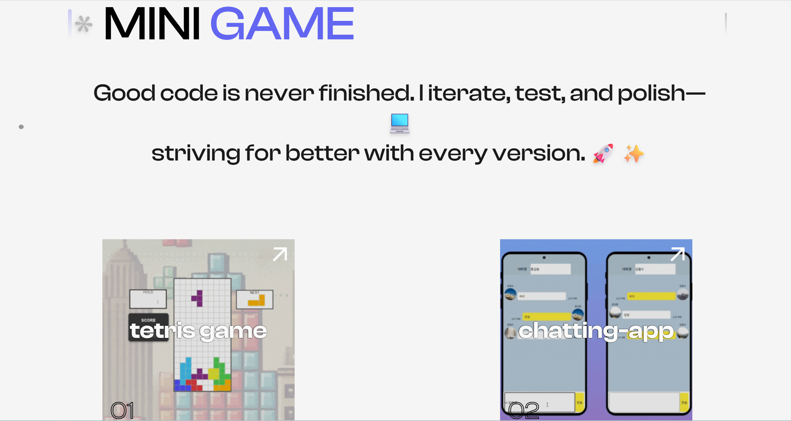
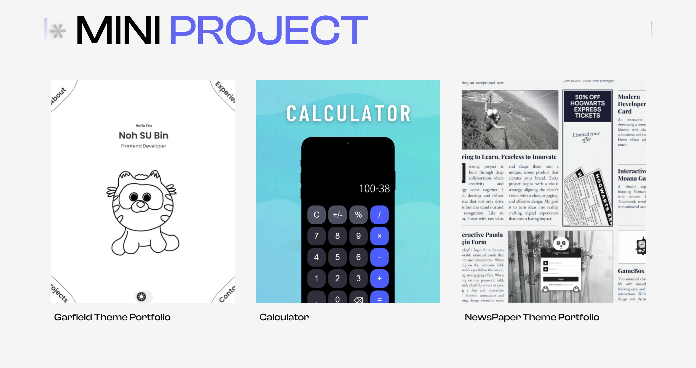
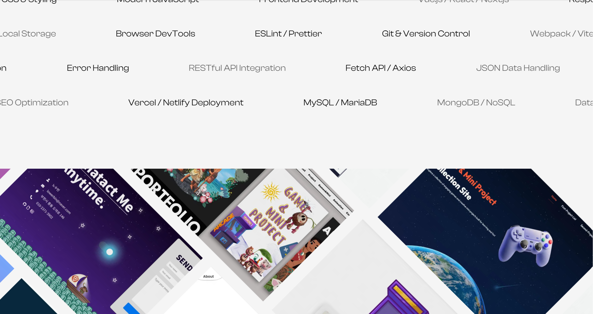

## Portfolio 2025 – Next.js 15, React 19, GSAP, Framer Motion

A modern personal portfolio built with Next.js 15 and React 19. Smooth animations with GSAP and Framer Motion, Lenis-based smooth scrolling, responsive layouts, and a production-ready contact form powered by EmailJS.

---

### Features

| Features               | Description                                                         |
|--------------------|--------------------------------------------------------------|
| **커스텀 커서**     | 마우스 움직임에 반응하는 인터랙티브 커서                     |
| **로딩 애니메이션** | 페이지 진입 시 시각적 로딩 효과                             |
| **스무스 스크롤링** | 부드러운 페이지 스크롤                                       |
| **반응형 디자인**   | 데스크톱과 모바일 환경을 모두 지원하는 반응형 레이아웃       |
| **Projects**        | 프로젝트 소개 및 상세 정보 모달                             |
| **Portfolios**      | 포트폴리오 갤러리 (데스크톱: 가로 스크롤, 모바일: 세로 레이아웃) |
| **Mini Games**      | 미니 게임 섹션 (비디오 포스터 및 모달 상세 정보)             |
| **Mini Projects**   | 소규모 프로젝트 및 학습 결과물 전시 (카드 형태)             |
| **텍스트 애니메이션** | 타이핑 및 분할 애니메이션                                   |
| **프로젝트 모달**   | 포트폴리오 프로젝트 상세 정보                               |
| **Top/Bottom Message** | 섹션 간 디자인 메시지                                      |
| **Contact**         | 연락처 정보 및 문의 폼 (EmailJS 연동)                       |
| **Parallax Gallery** | 시차를 이용한 3D 갤러리 효과 (데스크톱 전용)                |


---

### UI Preview / Screenshots

<div style="display: flex; flex-wrap: wrap; gap: 10px;">
  
  
  
  
  
  
  
  
</div>

---

### Tech Stack

- Framework: **Next.js 15**, **React 19**, **TypeScript 5**
- Animation: **GSAP**, **@gsap/react**, **Framer Motion**, **SplitType**
- Forms/Validation: **React Hook Form**, **Zod**, **@hookform/resolvers**
- Smooth Scroll: **Lenis**
- UI / Utilities: **Radix UI (Label/Slot)**, **tailwind-merge**, **clsx**, **Lucide**
- Carousel: **Swiper**
- Email: **@emailjs/browser**
- Images: **sharp** (dev), Next.js Image with WebP/AVIF

---

### Getting Started

Prerequisites:

- Node.js 18+ (Recommended), pnpm/npm/yarn

Install dependencies:

```bash
npm install
```

Run development server (Turbopack):

```bash
npm run dev
```

Build and start production:

```bash
npm run build
npm start
```

Lint and format:

```bash
npm run lint
npm run lint:fix
npm run format
```

Optional – optimize local images (if you add new assets):

```bash
npm run optimize-images
```

---

### Project Structure (high level)

```
app/                   # Next.js App Router pages/layout
components/            # Reusable UI + section components
  layout/              # Navbar, Menu, Custom cursor, Showreel
  sections/            # Home, About, Portfolio, Projects, Mini Projects, Contact
  ui/                  # Buttons, inputs, modals, common UI primitives
lib/                   # animations, hooks, utils, data, responsive helpers
public/                # images, fonts, icons, GIFs, service worker
styles/                # global CSS modules
```

Key config:

- `next.config.ts`: image formats (WebP/AVIF), CSP for SVGs, cache headers, bundle analyzer opt-in
- `eslint.config.mjs`, `.prettierrc`: linting and formatting
- `tsconfig.json`: TypeScript config

---

### Notable Implementation Details

- **Animations** are organized under `lib/animations` and related section components. GSAP is used for complex timelines; Framer Motion handles entrance/transition effects.
- **Parallax Gallery** uses performant transforms and pre-optimized assets under `public/parallax-gallery`.
- **Contact Form** integrates EmailJS with schema validation (Zod) and controlled inputs (React Hook Form).
- **Image Policy** enables `image/webp` and `image/avif`, with sensible device/image sizes and long-lived cache headers.

---

### Environment & EmailJS

For the contact form to send emails, configure EmailJS public key, service ID, and template ID. Create a small config (already included as `emailjs-config.js`) or use environment variables if you prefer. Update your values in the integration code.

---

### Scripts

- `dev`: `next dev --turbopack`
- `build`: `next build`
- `start`: `next start`
- `lint`: `next lint`
- `lint:fix`: `next lint --fix`
- `format`: `prettier --write .`
- `optimize-images`: `node scripts/optimize-images.js`

---

### Accessibility & Performance

- Semantic HTML and keyboard-friendly components where applicable
- Motion reduced when `prefers-reduced-motion` is enabled (where feasible)
- Optimized images, lazy loading, and GPU-accelerated transforms
